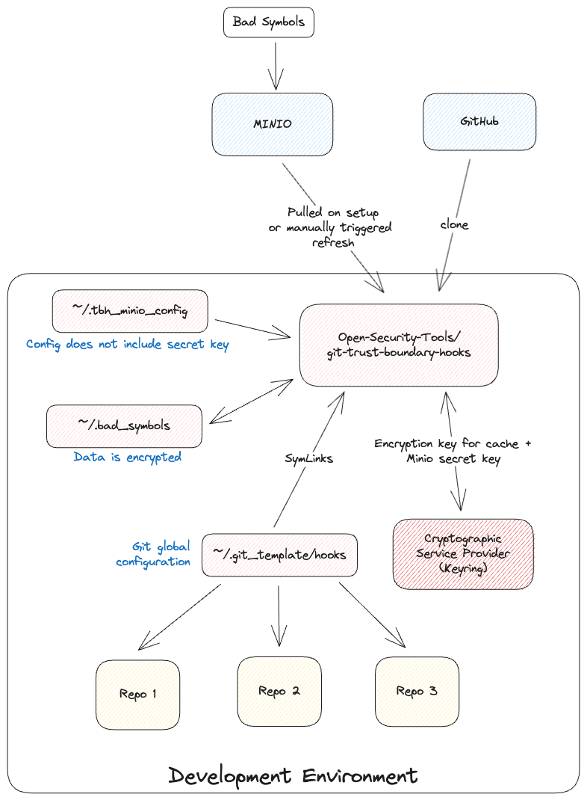

# Git Trust Boundary Hooks

This is a Python utility which uses git hooks (https://git-scm.com/book/en/v2/Customizing-Git-Git-Hooks) to detect bad symbols in:

1. Commit messages
2. File names
3. File contents
4. Commit author metadata

## Why would I need this?

Whilst many development activities occur privately, some require communications across trust boundaries.

Trust boundaries could occur between organisations, or when publishing to public (for example open source) repositories.

If there is information you don't want traversing the trust boundary, then you want to detect it before it is out of your control.
This utility is a mechanism to do that detection at the point you make local changes to git repositories and before you push them to remote destinations.

## Design

The deployment happens in the context of a development environment.
For example, a profile on your development workstation.

This Python utility acts as a shared implementation of the git hooks for commiting and pushing using git's template mechanism.

Bad symbols are loaded from an external Minio object store and cached locally.
Credentials for the Minio service and the symmetric key for the local encrypted cache of bad symbols are handled by the `keyring` module.

Cached bad symbols are encrypted using AES128 (GSM).
The symmetric key is generated during module setup.



## Usage

Any git repositories you initialise or clone after installing the global template will hook the following git operations:

1. `commit-msg`
2. `pre-commit`
3. `pre-push`

If the checks against bad symbols fail then the operation is blocked.

In addition, you can scan history, cached and untracked files manually using:

```bash
.git/tbh-utils scan
```

## Installation

Do this per development environment:

```bash
# Someonewhere sensible
mkdir -p ~/projects/github/open-security-tools
cd ~/projects/github/open-security-tools

# Clone 
git clone https://github.com/Open-Security-Tools/git_trust_boundary_hooks
cd open-security-tools

# Prepare virtual python environment
python3 -mvenv env
source env/bin/activate
pip install --upgrade pip
pip install -e .

# Install the hooks and set up the global git template
tbh-setup
# NOTE - this will initially fail pending the configuration for downloading bad symbols.
```

### Minio for Bad Symbol Storage

If multiple development environments are used then bad symbol definition need central and private coordination.

This implementation downloads the bad symbols from a Minio S3 object store.
See https://min.io/.
